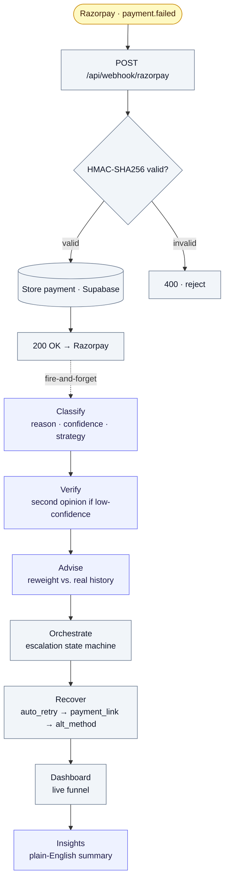

# Razor Recovery

**AI-driven recovery for failed Razorpay payments — Razorpay AI Buildathon · Track 3: AI Revenue Recovery**

A `payment.failed` webhook is verified, classified by an LLM agent, sanity-checked by a second agent when
confidence is low, reweighted against real recovery history, then executed and escalated by a deterministic
orchestrator — all backed by an LLM provider fallback chain (OpenRouter → Groq → Mistral) with a per-session
call ceiling, and summarized live on a dashboard.

---

## Documentation index

| Topic | Link | Key coverage |
| --- | --- | --- |
| Architecture & agent design | [CLAUDE.md](CLAUDE.md) | The `agents/` vs `services/` split, module map, non-negotiable conventions |
| Phase-by-phase build log | [docs/](docs/) | The full build history — one flat file per phase (`phase-1.md` … `phase-5-orchestration.md`) |
| Failure injection & hardening | [docs/phase-4.md](docs/phase-4.md) · [scripts/inject.js](Backend/scripts/inject.js) | Duplicate storms, malformed payloads, provider outages, quota limits, mid-classify orphans |

**Build phases:** [Phase 1](docs/phase-1.md) · [Phase 2](docs/phase-2.md) · [Phase 3](docs/phase-3.md) · [Phase 4](docs/phase-4.md) · [Phase 5 — orchestration](docs/phase-5-orchestration.md)

> **Note:** there is no `docs/failures.md` in the repo — the failure-injection log lives in the Phase 4 doc above,
> and the harness that reproduces each scenario is [`Backend/scripts/inject.js`](Backend/scripts/inject.js).

---

## System overview

The closed loop, exactly as [`Backend/src/routes/webhook.js`](Backend/src/routes/webhook.js) runs it:

1. **Observe** — Razorpay fires a `payment.failed` webhook at `POST /api/webhook/razorpay`.
2. **Verify** — the HMAC-SHA256 signature over the *exact raw body* is checked before any processing (invalid → `400`).
   The failed payment is stored in Supabase (re-deliveries deduped via the unique constraint + Postgres `23505`), and
   Razorpay is acked `200` immediately — everything below runs **fire-and-forget** so LLM latency can never drop a payment.
3. **Classify** — the Classification agent turns the raw `error_code` / `error_description` into
   `{ reason, detail, confidence, suggested_strategy }` over the LLM fallback chain (OpenRouter → Groq → Mistral).
4. **Verify (agent)** — a confidence-weighted consensus check: when confidence is low, an independent Verifier agent spends one extra call to re-check the
   primary result, and may override the reason/strategy before anything is persisted or acted on.
5. **Advise** — the Strategy Advisor reweights the suggested strategy against *real historical recovery outcomes* for
   that failure reason; its output is the strategy that actually gets executed.
6. **Recover** — the orchestrator executes the decision and escalates through the fixed policy
   `auto_retry → payment_link → alt_method`, marking the payment `lost` only if the whole chain is exhausted.
7. **Report** — the dashboard renders the live funnel, money recovered/lost, and reason/strategy breakdowns, while the
   Insights agent summarizes the aggregate in plain English.

Agents never throw on the webhook path: a total provider outage degrades to a safe default
(`reason: other`, `confidence: 0`, `suggested_strategy: payment_link`) rather than failing the payment.

---

## High-level architecture



Using the same distinction the app's own [**How It Works**](frontend/src/pages/Architecture.tsx) page draws:

- 🟦 **Agent (LLM / data-driven judgment)** — `Classify` · `Verify` · `Advise` · `Insights`. Each makes a judgment call.
- ⬜ **Deterministic infrastructure** — the webhook, signature check, store, `Orchestrate`, `Recover`, and `Dashboard`.
  Plumbing that *sequences* the decisions; it doesn't make them.

---

## Project directory layout

```
.
├── package.json                    root scripts: test / dev:backend / dev:frontend / build
├── README.md
├── CLAUDE.md                       architecture + conventions (read before changing code)
├── docs/                           phase-by-phase build log (phase-1.md … phase-5-orchestration.md) + DEMO_SCRIPT.md
│
├── Backend/                        Node.js + Express, JavaScript / CommonJS
│   ├── .env.example
│   ├── db/
│   │   └── schema.sql               tables + idempotent `alter … add column if not exists` migrations
│   ├── scripts/
│   │   └── inject.js                failure-injection harness (signed webhooks → localhost)
│   └── src/
│       ├── server.js                Express app; mounts every route under /api, serves built frontend
│       ├── config/
│       │   ├── supabase.js          service_role Supabase client
│       │   └── escalationPolicy.js  fixed auto_retry → payment_link → alt_method table
│       ├── lib/
│       │   └── signature.js         Razorpay webhook HMAC verification  (+ signature.test.js)
│       ├── agents/                  ← AI decision-makers (LLM-backed or history-driven judgment)
│       │   ├── classificationService.js   classify a failure → { reason, strategy, confidence }
│       │   ├── verifierService.js         second opinion when the primary is low-confidence
│       │   ├── strategyAdvisorService.js  reweight strategy from real recovery outcomes
│       │   └── insightsService.js         natural-language summary of the dashboard aggregate
│       ├── services/               ← deterministic infrastructure, NOT agents
│       │   ├── orchestratorService.js  control flow: which recovery step runs next
│       │   ├── recoveryService.js      executes an attempt (auto_retry / payment_link / alt_method)
│       │   └── usageCounters.js        per-session LLM / Razorpay call counters + ceiling
│       └── routes/
│           ├── health.js            GET  /api/health
│           ├── webhook.js           POST /api/webhook/razorpay        (+ webhook.test.js)
│           ├── dashboard.js         GET  /api/dashboard               (+ dashboard.test.js)
│           ├── insights.js          GET  /api/insights, POST /api/insights/ask
│           └── test.js              debug routes, mounted under /api/debug
│
└── frontend/                       Vite + React + TypeScript dashboard
    ├── .env.example
    ├── vite.config.ts               dev server proxies /api → http://localhost:3000
    └── src/
        ├── main.tsx                 router (/  /checkout  /agents  /how-it-works  /debug/payments)
        ├── App.tsx                  dashboard: funnel, money cards, breakdowns, recent activity
        ├── lib/supabaseClient.ts    anon-key browser client
        ├── components/              Layout · StatusPill · InsightsPanel · JourneyTracker
        └── pages/
            ├── TestCheckout.tsx      /checkout — trigger a real test-mode failed payment
            ├── RecoveryJourneys.tsx  /agents — per-payment trace through every step
            ├── Architecture.tsx      /how-it-works — the "How It Works" overview
            └── PaymentsDebug.tsx     /debug/payments — raw utilitarian debug table
```

Every non-trivial backend module ships a plain-`assert` self-test alongside it (`node <file>.test.js`).

---

## Quickstart

```bash
git clone <repo-url>
cd <repo-name>

# 1. Apply the database schema once (Supabase SQL editor, or psql):
#    run Backend/db/schema.sql against your Supabase project — it is idempotent.

# Backend
cd Backend
cp .env.example .env    # fill in Supabase, Razorpay, and LLM provider keys
npm install
npm run dev             # http://localhost:3000

# Frontend (separate terminal)
cd frontend
cp .env.example .env
npm install
npm run dev             # http://localhost:5173 — proxies /api to backend

# Tunnel for Razorpay webhooks (dev only)
npx ngrok http 3000     # point your Razorpay webhook at <ngrok-url>/api/webhook/razorpay
```

> From the repo root you can also use the convenience scripts: `npm run dev:backend`, `npm run dev:frontend`, `npm run build`.

### Required environment variables

**`Backend/.env`** (from [`Backend/.env.example`](Backend/.env.example)):

| Variable | Purpose |
| --- | --- |
| `PORT` | Port the Express server binds (default `3000`) |
| `SUPABASE_URL` | Supabase project URL |
| `SUPABASE_SERVICE_ROLE_KEY` | Supabase `service_role` key — backend only, **never** expose to the browser |
| `RAZORPAY_KEY_ID` | Razorpay test-mode key id |
| `RAZORPAY_KEY_SECRET` | Razorpay test-mode key secret |
| `RAZORPAY_WEBHOOK_SECRET` | Secret used to verify inbound webhook HMAC signatures |
| `OPENROUTER_API_KEY` | Primary LLM provider (Nemotron via OpenRouter) |
| `GROQ_API_KEY` | Second LLM provider in the fallback chain |
| `MISTRAL_API_KEY` | Third LLM provider in the fallback chain |

Model ids (`OPENROUTER_MODEL`, `GROQ_MODEL`, `MISTRAL_MODEL`), the primary timeout (`OPENROUTER_TIMEOUT_MS`), and the
per-session safety ceilings (`MAX_LLM_CALLS_PER_SESSION`, `MAX_RAZORPAY_CALLS_PER_SESSION`) all have sensible defaults —
see `Backend/.env.example`.

**`frontend/.env`** (from [`frontend/.env.example`](frontend/.env.example)): `VITE_SUPABASE_URL` and `VITE_SUPABASE_ANON_KEY`
(the **anon** key only — safe for the browser).

---

## API reference

All routes are mounted under `/api`; debug-only routes live under `/api/debug`.

| Method | Path | Description |
| --- | --- | --- |
| `GET` | `/api/health` | Liveness check — confirms the process is up and Supabase is reachable |
| `POST` | `/api/webhook/razorpay` | Razorpay webhook: verifies the signature, stores `payment.failed`, handles `payment_link.paid`, then fires classify → recover |
| `GET` | `/api/dashboard` | Aggregated funnel, money recovered/lost, reason & strategy breakdowns, recent activity |
| `GET` | `/api/insights` | Natural-language summary of the dashboard aggregate (cached; safe templated fallback) |
| `POST` | `/api/insights/ask` | Bounded Q&A over the dashboard's own data — `{ question } → { answer }` |
| `POST` | `/api/debug/create-order` | **Debug** — create a Razorpay test-mode order for the checkout page |
| `GET` | `/api/debug/payments` | **Debug** — raw payments with embedded classification |
| `GET` | `/api/debug/usage` | **Debug** — in-memory per-session LLM / Razorpay call counters |
| `POST` | `/api/debug/reclassify` | **Debug** — reconciliation sweep: re-classify payments left orphaned by a mid-classify crash |

---

## The four agents

The AI decision-makers in [`Backend/src/agents/`](Backend/src/agents/), in the words the app's How It Works page uses:

1. **Classification** — figures out why the payment failed (`reason`, `detail`, `confidence`, `suggested_strategy`).
2. **Verifier** (confidence-weighted consensus) — double-checks when the primary classifier is unsure, and can override it.
3. **Strategy Advisor** — picks the strategy that's worked best before, reweighting against real recovery history.
4. **Insights** — summarizes it all in plain English for the dashboard.

Everything else — the webhook, orchestrator, and recovery calls — is deterministic plumbing that sequences these
decisions; it doesn't make them.

---

## Testing

```bash
npm test          # from repo root — runs the full backend assert suite (cd Backend && npm test)
npm run build     # from frontend/ — tsc -b && vite build, confirms a clean TypeScript build
```

The backend suite runs each module's co-located `*.test.js` (signature, usage counters, dashboard aggregation, all four
agents, webhook parsing, recovery, orchestrator). A failure-injection harness,
[`Backend/scripts/inject.js`](Backend/scripts/inject.js), sends correctly-signed webhooks to a running server to
reproduce duplicate storms, malformed payloads, provider outages, and quota exhaustion on demand;
[`docs/phase-4.md`](docs/phase-4.md) documents what broke and how it was hardened during Phase 4.

---

## Status

Built for the **Razorpay AI Buildathon (Track 3: AI Revenue Recovery)**. Private project (`package.json` → `"private": true`),
test-mode only, no formal open-source license.
